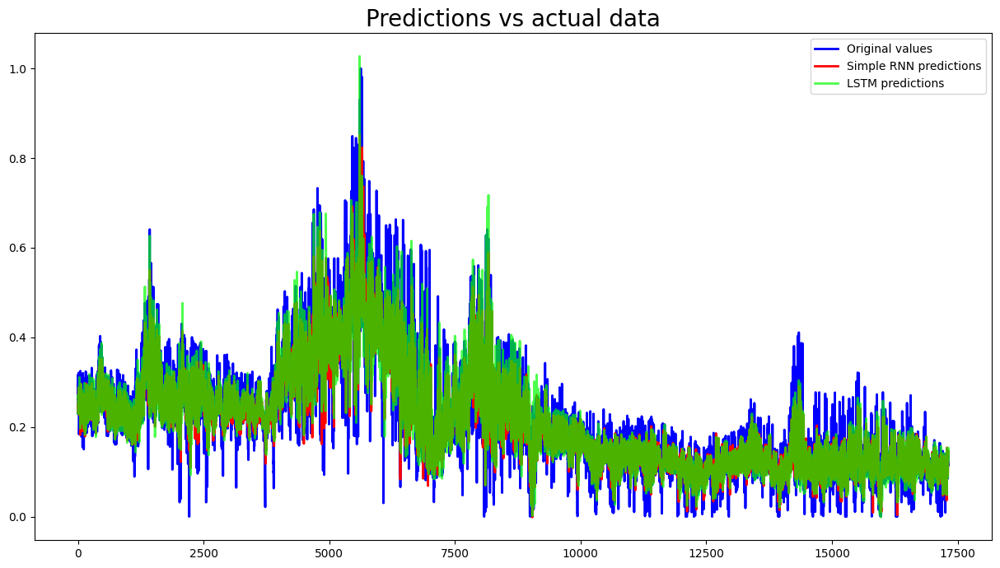
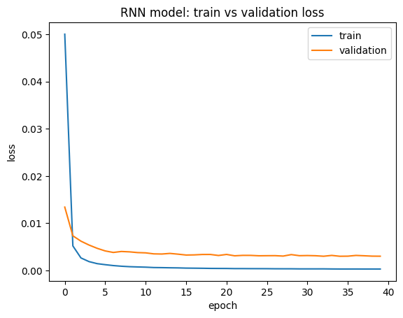
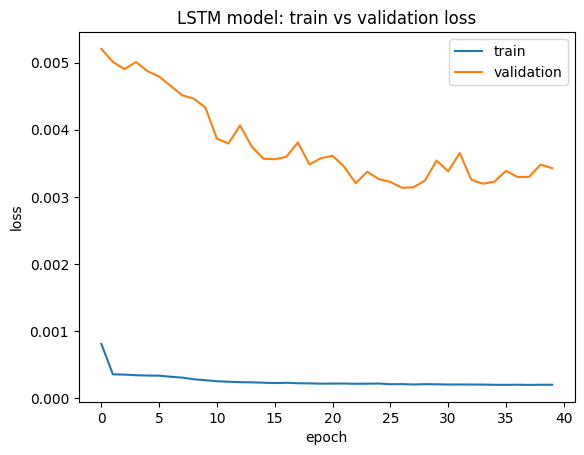

# Forecasting exchange rate
## Description
* The file contains forecasts for electecity prices under a simple Recurrent Neural Network (RNN) model and a Long short-term memory (LSTM) network.
*  **Data:** For the purpose of the project, hourly data on wholesale day-ahead electricity price in Greece (EUR/MWhe) for the period 1 Jan 2015 – 31 Dec 2023, sourced by [Ember](https://ember-climate.org/data-catalogue/european-wholesale-electricity-price-data/).
* **Methodology:** At first, a seasonal decomposition and an apropriate visualisation is performed to observe any seasonal patterns.
Then, the timespan is splitted into a training (1 Jan 2015 - 31 Dec 2021) and a test (1 Jan 2022 - 31 Dec 2023) period.
Finally, electricity prices are forecasted based on a simple RNN and a LSTM model based on the same parametrization.

* **Results**: Figure 1 presents forecasts under both models compared to the actual dataset. Data are normalized.
The $R^2$ is 0.79 for the simple RNN model and 0.81 for the LSTM, indicating a slightly better fit in the latter case.
Loss functions converge relatively quickly under both models (Figures 2b and 2c).
 
**Figure 1: Hourly forecasts of wholesale day-ahead electricity price data: simple RNN vs LSTM** 

**Figure 2a: Loss functions under a simple RNN model** 

**Figure 2b: Loss functions under a LSTM model** 

